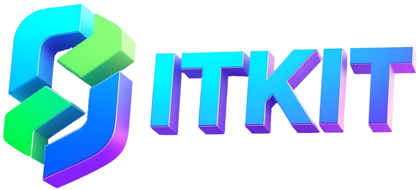

# ITKIT Documentation

Welcome to the ITKIT documentation! ITKIT is a user-friendly toolkit built on `SimpleITK` and `Python`, designed for common data preprocessing operations in data-driven CT medical image analysis.

## 📖 Table of Contents

### Getting Started

- **[Installation Guide](installation.md)** - Install ITKIT and its dependencies
- **[Dataset Structure](dataset_structure.md)** - Understand the required dataset format

### Processing Tools

- **[itk_check](itk_check.md)** - Image checking and validation
- **[itk_resample](itk_resample.md)** - Resampling to target spacing/size
- **[itk_orient](itk_orient.md)** - Image re-orientation
- **[itk_patch](itk_patch.md)** - Patch extraction
- **[itk_aug](itk_aug.md)** - Data augmentation
- **[itk_extract](itk_extract.md)** - Label extraction
- **[itk_combine](itk_combine.md)** - Label merging and intersection
- **[itk_convert](itk_convert.md)** - Format conversion
- **[itk_infer](itk_infer.md)** - Batch inference with MMEngine/ONNX backends
- **[itk_evaluate](itk_evaluate.md)** - Segmentation evaluation with comprehensive metrics

### Advanced Topics

- **[Framework Integration](framework_integration.md)** - Integration with deep learning frameworks
  - OpenMMLab extensions
  - MONAI integration
  - TorchIO integration
  - PyTorch Lightning support

- **[3D Slicer Integration](slicer_integration.md)** - 3D Slicer extension for inference
  - Install and configure the Slicer extension
  - Run inference directly in 3D Slicer
  - MMEngine and ONNX backend support
  - Sliding window inference for large volumes

- **[Web Interface](web_interface.md)** - Browser-based GUI (`itkit-web`)
  - Full-featured alternative to the PyQt desktop GUI
  - Embedded file browser and per-tool parameter panels
  - Real-time log streaming and progress display
  - REST API for scripted access

- **[Neural Network Models](models.md)** - State-of-the-art segmentation models
  - Transformer-based models (SegFormer, UNETR, DA-TransUNet)
  - State space models (VMamba, SwinUMamba, SegMamba)
  - CNN-based models (MedNeXt, UNet3+, DconnNet)

- **[Supported Datasets](datasets.md)** - Dataset conversion scripts
  - AbdomenCT-1K, BraTS 2024, KiTS23
  - FLARE 2022/2023, TotalSegmentator
  - LiTS, LUNA16, CTSpine1K
  - And more...

### Community

- **[Contributing Guide](contributing.md)**
  - Development setup
  - Code style guidelines
  - Submission process
  - Release policy

## 🚀 Key Features

- **🔧 Feasible Operations**: Simple command-line interface for complex ITK operations
- **🖥️ GUI Support**: PyQt6-based graphical interface for easier interaction
- **🔌 Framework Integration**: Seamlessly works with MONAI, TorchIO, and OpenMMLab
- **🧠 Comprehensive Models**: State-of-the-art medical segmentation networks
- **📊 Multiple Datasets**: Conversion scripts for 12+ popular medical imaging datasets
- **⚡ High Performance**: Multiprocessing support for faster preprocessing
- **🎨 Flexible**: Works with multiple file formats (MHA, NIfTI, NRRD, DICOM)

## 📝 Citation

If you use ITKIT in your research, please cite:

```bibtex
@misc{ITKIT,
    author = {Yiqin Zhang},
    title = {ITKIT: Feasible Medical Image Operation based on SimpleITK API},
    year = {2025},
    url = {https://github.com/MGAMZ/ITKIT}
}
```

## 📧 Contact

For questions or suggestions, reach out at: [312065559@qq.com](mailto:312065559@qq.com)

## 📄 License

ITKIT is released under the [MIT License](https://github.com/MGAMZ/ITKIT/blob/main/LICENSE).
